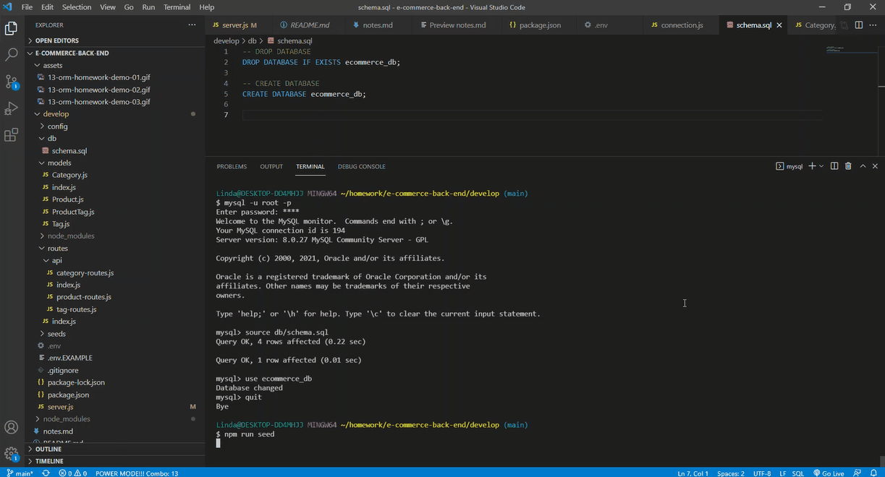
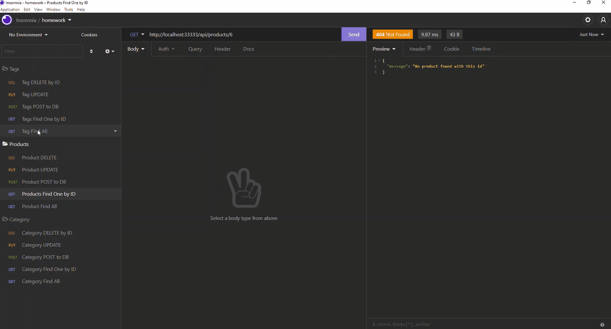
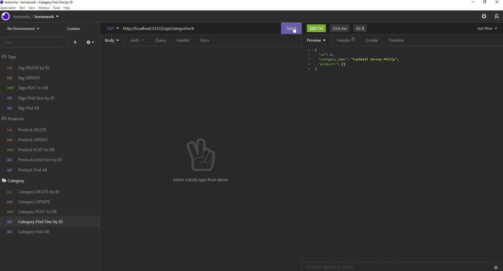

# E-Commerce Back End

## Overview

Internet retail, also known as **e-commerce**, is the largest sector of the electronics industry.  In this project, I was tasked to build the back end for an e-commerce site by modifying starter code. In doing so I  configured a working Express.js API to use Sequelize to interact with a MySQL database.


# Links
 ## YouTube Link
 https://youtu.be/WcYzRdlOab0

 ## GitHub Repo
 https://github.com/lindamart/e-commerce-back-end

## Table of Contents 

* [Links](#links)

* [Preview](#preview)

* [Criteria](#criteria) 

* [Contact](#contact)

* [Credits](#credits)

* [License](#license)

* [Author](#author)


# Preview







# Criteria
```
GIVEN a functional Express.js API
WHEN I add my database name, MySQL username, and MySQL password to an environment variable file
THEN I am able to connect to a database using Sequelize

WHEN I enter schema and seed commands
THEN a development database is created and is seeded with test data

WHEN I enter the command to invoke the application
THEN my server is started and the Sequelize models are synced to the MySQL database

WHEN I open API GET routes in Insomnia Core for categories, products, or tags
THEN the data for each of these routes is displayed in a formatted JSON

WHEN I test API POST, PUT, and DELETE routes in Insomnia Core
THEN I am able to successfully create, update, and delete data in my database
```
# Contact

Contact me with any questions.

Linda Martinez [lindanmjw@gmail.com](mailto:lindanmjw@gmail.com)


# Credits 

W3 Schools: https://www.w3schools.com/

MDN Web Docs: https://developer.mozilla.org/en-US

ExpressJS: https://expressjs.com/

npm MySql: https://www.npmjs.com/

Insomnia: https://docs.insomnia.rest/

# License

The MIT License (MIT)

Copyright (c) 2022 Linda Martinez

Permission is hereby granted, free of charge, to any person obtaining a copy of this software and associated documentation files (the "Software"), to deal in the Software without restriction, including without limitation the rights to use, copy, modify, merge, publish, distribute, sublicense, and/or sell copies of the Software, and to permit persons to whom the Software is furnished to do so, subject to the following conditions:

The above copyright notice and this permission notice shall be included in all copies or substantial portions of the Software.

THE SOFTWARE IS PROVIDED "AS IS", WITHOUT WARRANTY OF ANY KIND, EXPRESS OR IMPLIED, INCLUDING BUT NOT LIMITED TO THE WARRANTIES OF MERCHANTABILITY, FITNESS FOR A PARTICULAR PURPOSE AND NONINFRINGEMENT. IN NO EVENT SHALL THE AUTHORS OR COPYRIGHT HOLDERS BE LIABLE FOR ANY CLAIM, DAMAGES OR OTHER LIABILITY, WHETHER IN AN ACTION OF CONTRACT, TORT OR OTHERWISE, ARISING FROM, OUT OF OR IN CONNECTION WITH THE SOFTWARE OR THE USE OR OTHER DEALINGS IN THE SOFTWARE.
  
